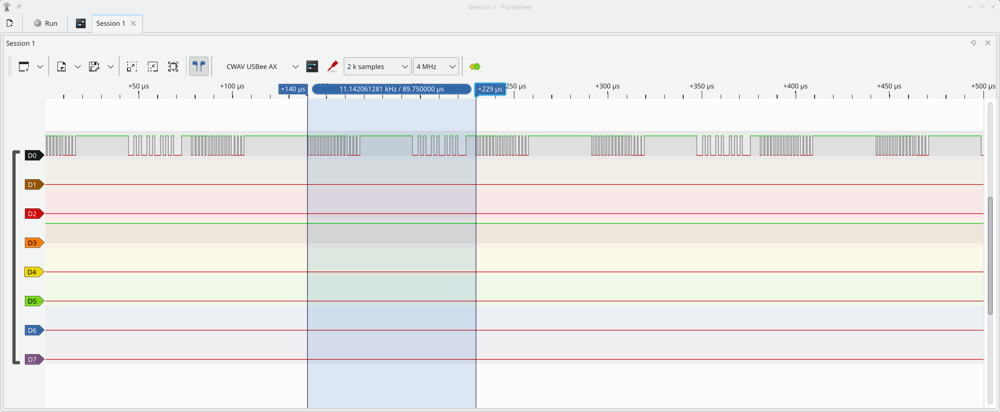
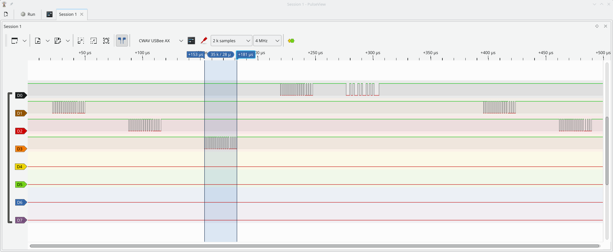
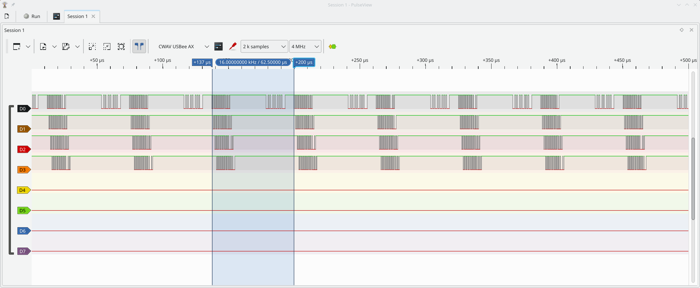

# Raspberry Pi Pico DSHOT Library

This C library allows to control BLDC motors (brushless DC motors) from a Raspberry Pi Pico
connected to one or multiple ESC (electronic speed controller) using the DSHOT protocol [1].
Both transmission and telemetry reception (EDT/eRPM) are supported. One PIO statemachine per
controller is used to send and receive the DSHOT data. DSHOT bitrates from 150 to 1200 kbit/s
and beyond are supported. One controller can control multiple channels (frames are sent
interleaved).

[1] https://brushlesswhoop.com/dshot-and-bidirectional-dshot/

## Importing the library

* Add this repository as a submodule into your project, e.g. ``modules/dshot``
* Add the the subdirectory and link the library to your app in your CMakeLists.txt:
```
add_subdirectory(modules/dshot)
target_link_libraries(myappname ... dshot)
```

## ESC requirements

The ESC needs to support inverted DSHOT / bidirectional DSHOT, which is the
case for BLHeli_32, BLHeli_S, Bluejay and others. Not all firmwares support
Extended DSHOT Telemetry (EDT) for report Voltage, Current and temperature.
BLHeli_32 supports EDT with version 32.10.0.0 and forward. Bluejay should
also support EDT, but has not been tested.

## Examples

Examples can be found in the ``examples`` directory

```
mkdir -p build
cd build
cmake .. -DPICO_SDK_PATH=/path/to/pico-sdk
make -C examples
cd ..
```

You'll find uf2 binaries in build/examples/

### Example 1

Minimal example with one controller and one channel (GPIO pin 2), with DSHOT600.
Sends a beep command once a second.

Signal Analyzer view:



### Example 2

More sophisticated example with one controller and four channels (GPIO pin 2 to 5).
Telemetry data is interpreted and the result is printed on USB stdout. Note that the
controller sends to the channel interleaved. Note also the time gap caused by the
printing.

Signal Analyzer view (only channel 0 is connected/working, the others are not receiving
telemetry data):



### Example 3

Similar to example 2, but using an asynchronous loop with four channels, one
controller per channel. DSHOT1200 is used. The four channels are roughly sending at the same time,
with some delay caused by the setup of each channel.

Signal Analyzer view (only channel 0 is connected/working, the others are not receiving
telemetry data):



